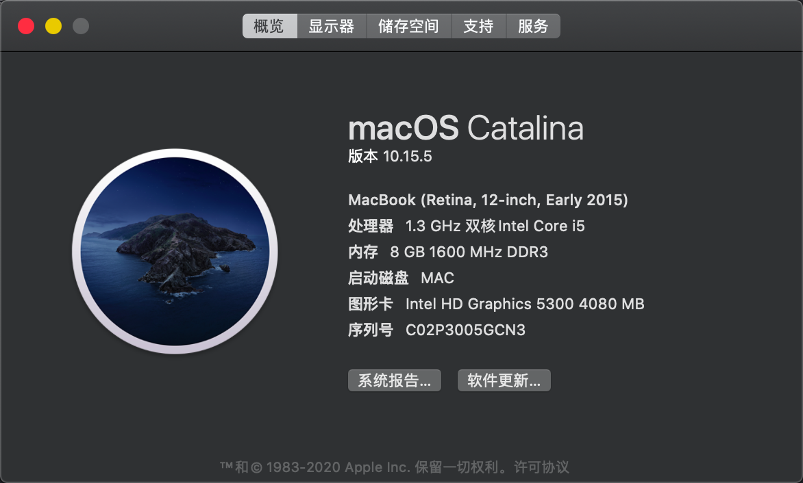
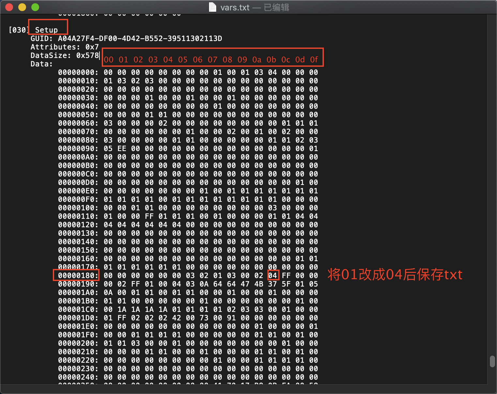
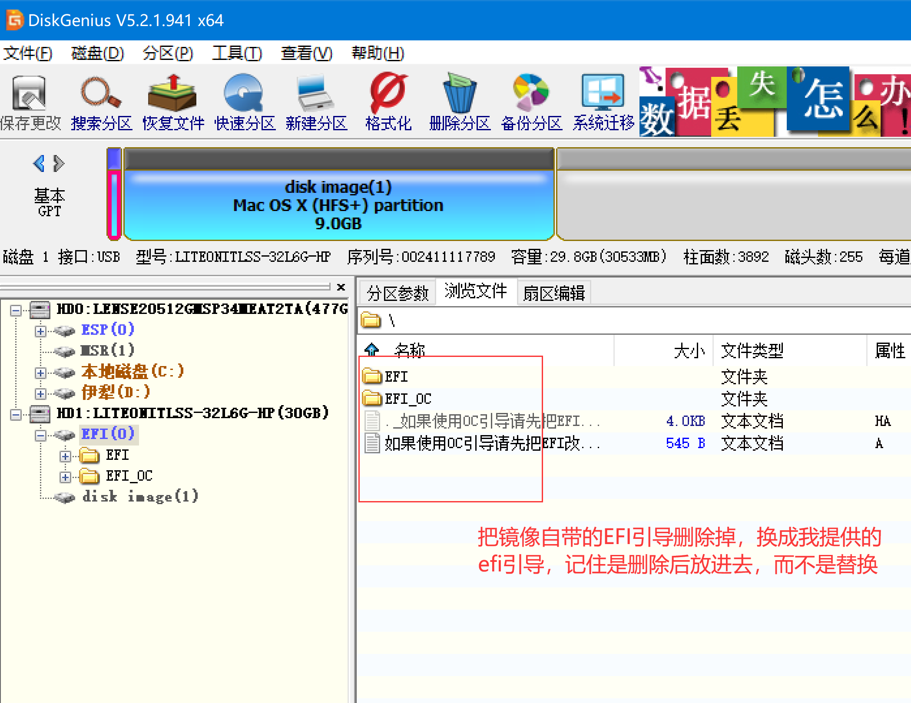
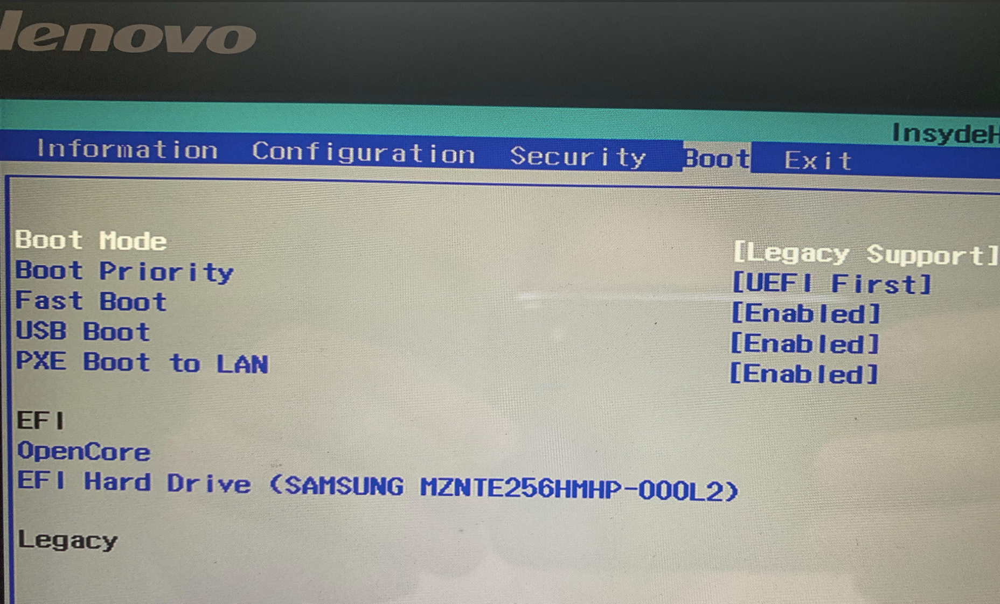
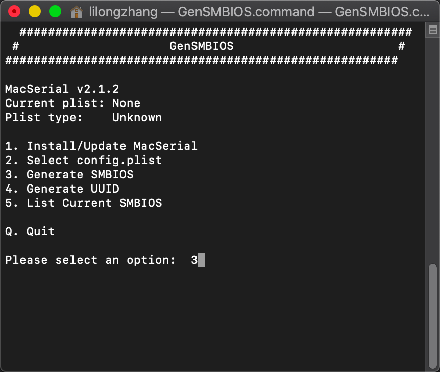
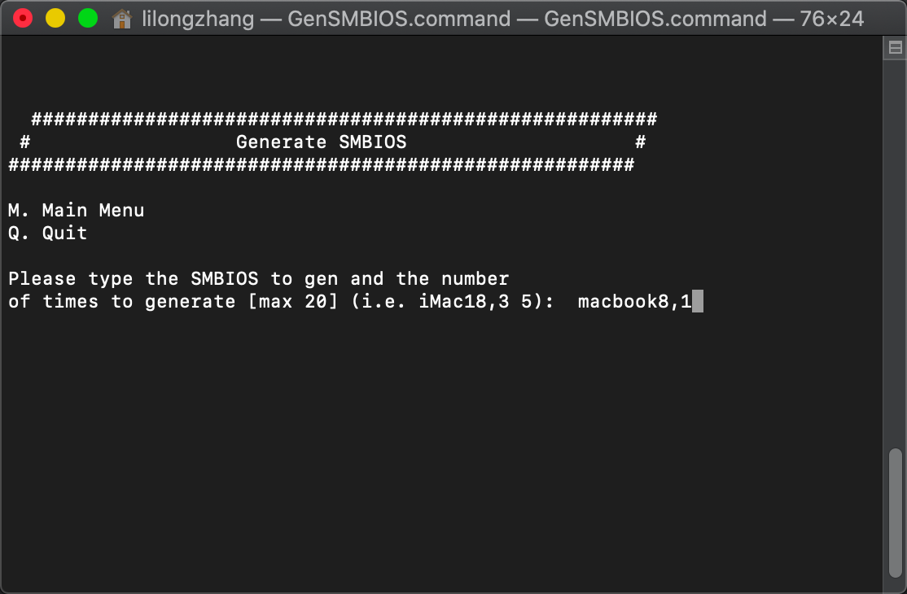
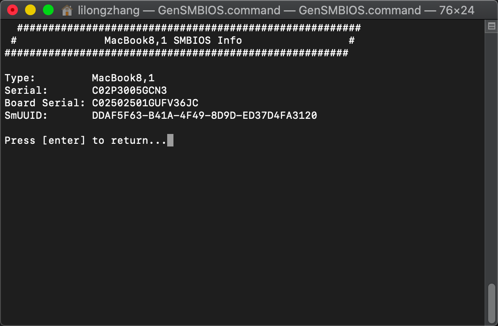
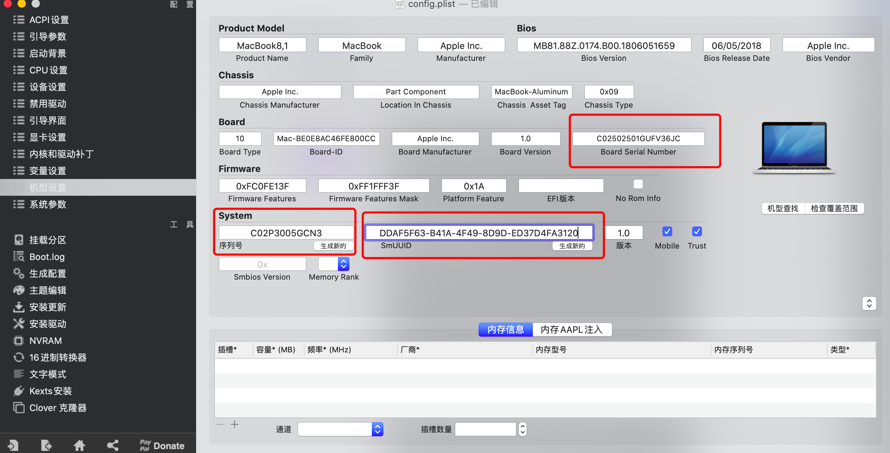

# Lenovo Yoga3 Pro **黑苹果安装**

## 前言
#### 安装黑苹果有风险，对于本指南中出现的任何变砖，系统崩溃，冻结，故障，损坏或其他问题，本人不承担任何责任。这样做需要您自担风险。 请认真了解hackintosh相关资料后进行安装操作。  
#### 目前clover版本的EFI引导较为完善、Opencore版本的引导仍有缺陷（睡眠问题），不建议安装。 
    
## 一、机型配置    

|项目|信息|
|:-----:|-----|
|版本信息|Lenovo YOGA 3 Pro-1370/BIOS:A6CN58WW|
|操作系统|Mojave 10.14.6/macOS Catalina 10.15.5|
|CPU信息|Mobile DualCore Intel Core M-5Y70, 2600 MHz (26 x 100)|
|显示屏幕|Samsung LTN133YL03L01  [13.3" LCD] 3200x1800|
|主板芯片组|Intel Wildcat Point-LP, Intel|
|内存信息|8192MB  (DDR3 SDRAM)|
|显卡信息|Intel(R) HD Graphics 5300(platform-id:0x16260006)|
|硬盘信息|LITEON LGH-512V2G-11 M.2 2280 512GB  (476 GB)|
|网卡信息|Broadcom Bcm94352z|
|声卡信息|Realtek ALC286@ AppleALC layout-id:11|
|触摸设备|i2c触摸板SYNA2B22/i2c触摸屏ATML1000|
|HDMI输出|Intel Broadwell HDMI视屏音频|

## 二、BIOS设置    
#### BIOS升级：将yoga3pro升级到最新的BIOS版本，最新的为A6CN58WW，如果已经是最新版本，忽略这一步，目前发现A6CN38WW出现频繁死机现象，不建议使用这个版本，升级时候记得把Boot mode改回去UEFI模式，安全启动打开，Secure Boot 打开才能顺利完成BIOS升级。  

*  – Secure Boot → disable  
*  – Boot MODE → Legacy Support   
*  – Boot MODE → Legacy Support 
*  –  Intel Virtual Technology → enabled  
*  – DPTF  → disable   

## 三、修改DVMT 
####  修改BIOS dvmt ：升级完成后进Windows或者是PE，打开已解压的H2OUVE_100.0.9.2.zip，双击目录下（Windows下管理员运行） 读取参数表.bat ，执行完后会在当前文件夹生成一个名为 vars.txt的文件 搜索内容 Setup 出现以下内容，我们只需要修改 00000180: 这行 倒数第四个将01改成04，然后保存txt文件。再使用 写入参数表.bat 将内容写入BIOS。此时已完成DVMT修改。
 为什么要改这个值，具体过程可以去远景查看 [YOGA900 修改DVMT方法](http://bbs.pcbeta.com/forum.php?mod=viewthread&tid=1848651)   ，根据说明YOGA3 PRO的BIOS解析出来修改的地址和要修改的值为 0x180c 0x4 

Variable: 0x180c表示该参数存储地址为18行 0c 列（16进制）
Option: 128M, Value: 0x4 表示128M  DVMT显存对应参数值为4（16进制）
  

   
## 四、安装方法    
#### 本方法适用于UEFI+GPT硬盘启动方式，硬盘格式为MBR请自行寻找方法转换成GPT格式。  

*   安装并覆盖破解文件至安装目录，使用transMac 将镜像写入至U盘，写盘完成后，使用diskgenius软件即可查看EFI分区，将EFI分区下面的EFI文件夹先删除后替换成我提供的文件 yoga3pro-20200626-clover ，解压后得到EFI文件夹放进去，目录看起来应该是像下图这样。
    
  安装前将BIOS设置如下图，不改的话会导致花屏。
  Boot Mde 改成 legacy support
  Boot Priorty 改成 UEFI First
    
  
*  开始安装系统，关机状态下插入外接USB鼠标，镜像盘，找尖锐的东西捅YOGA3 pro 右侧电源指示灯上面的小圆孔按钮（恢复键）
*  第一次使用U盘进去在CLOVER引导界面选择“Boot macOS Install from Install macOS Mojave”安装盘按回车键开始安装，等待跑码结束后进去语言选择界面、然后到 磁盘工具 把你需要安装的硬盘分区 抹除成为APFS格式 名称随便填，抹掉磁盘完成之后回到macOS使用工具界面，选择安装macOS到你刚才抹除的apfs分区。
*  系统重启后，CLOVER引导界面会多出几个卷标，请选择Boot macOS Install form MAC卷标继续安装  在系统安装过程中，请总是选择Boot macOS Install form MAC卷标继续安装，安装完成后，卷标名称将变更为：Boot macOS form MAC  
*  此时系统安装已经完成，进去设置一些东西，默认下一步即可，注意不要加密磁盘，以及先不要登陆 Apple ID 如有不明白的地方可以查看  
    
 [联想小新Air 13黑苹果安装教程](https://blog.daliansky.net/Lenovo-Xiaoxin-Air-13-macOS-Mojave-installation-tutorial.html)  
   
  
## 四、安装完成后，使用gensmbios生成序列号以及uuid  

#### 解压下载的 GenSMBIOS文件夹，目录下有个GenSMBIOS.command，双击运行  
根据提示选择3，创建smbios，根据我们型号的CPU得知为core M 5Y71，对应苹果系列产品应该是Macbook8,1，输入Macbook8,1 回车即可得出smbios，使用Clover   Configurator 对CLOVER/config.pilst 文件进行修改，把生成的序号填写进去。  
     
    
    
    
 
 ## 备注：     

## 有问题反馈
*  在使用中有任何问题，欢迎反馈给我，可以用以下联系方式跟我交流  
* 邮件(gdllzkusi@gmail.com) 
* QQ: 374593607  QQ群：778791091 
* 如果您认可我的工作，请通过打赏支持我后续的更新 
 
## 感谢   

- [RehabMan](https://github.com/RehabMan) 提供  [AppleBacklightInjector](https://github.com/RehabMan/HP-ProBook-4x30s-DSDT-Patch/tree/master/kexts/AppleBacklightInjector.kext) 和 [EAPD-Codec-Commander](https://github.com/RehabMan/EAPD-Codec-Commander) 和 [OS-X-ACPI-Battery-Driver](https://github.com/RehabMan/OS-X-ACPI-Battery-Driver) 和 [OS-X-Clover-Laptop-Config](https://github.com/RehabMan/OS-X-Clover-Laptop-Config) 和 [OS-X-FakeSMC-kozlek](https://github.com/RehabMan/OS-X-FakeSMC-kozlek) 和 [OS-X-USB-Inject-All](https://github.com/RehabMan/OS-X-USB-Inject-All) 和 [OS-X-Voodoo-PS2-Controller](https://github.com/RehabMan/OS-X-Voodoo-PS2-Controller) 和 [OS-X-BrcmPatchRAM)](https://github.com/RehabMan/OS-X-BrcmPatchRAM) 的维护
- [vit9696](https://github.com/vit9696) 提供 [Lilu](https://github.com/acidanthera/Lilu) 和 [AppleALC](https://github.com/acidanthera/AppleALC) 和 [WhateverGreen](https://github.com/acidanthera/WhateverGreen) 和 [VirtualSMC](https://github.com/acidanthera/VirtualSMC)  和 [VirtualSMC](https://github.com/acidanthera/VirtualSMC) 的维护
- [alexandred](https://github.com/alexandred) 和 [hieplpvip](https://github.com/hieplpvip) 提供 [AirportBrcmFixup](https://github.com/acidanthera/AirportBrcmFixup) 的维护
- [daliansky](https://github.com/daliansky) 和 [penghubingzhou](https://github.com/penghubingzhou) 和 [limurphy](http://i.pcbeta.com/space-uid-2163032.html) 的宝贵建议

